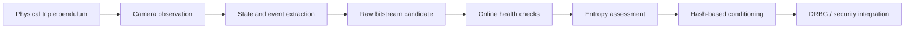

# Triple-Pendulum PRNG/TRNG System (ENTRIP)

This repository is the project hub for **ENTRIP**, a research project exploring a camera-observed triple pendulum as part of a physical-entropy architecture for hardware true random number generation (TRNG).

One technical idea was developed through several competitions and university programs. The `main` branch keeps the common project narrative, each event branch preserves the scope and artifacts presented at that stage, and GitHub Releases preserve runnable source snapshots without rewriting their directory structures.

> Research status: prototype architecture and initial validation. This project does **not** claim NIST SP 800-90B certification or production-ready cryptographic assurance.

## Project map

| Location | Event / stage | Focus | Result / status |
| --- | --- | --- | --- |
| [`competition/ask-2026`](https://github.com/limshoon/Triple-Pendulum-PRNG-TRNG-System/tree/competition/ask-2026) | ASK 2026, Korea Information Processing Society | Initial system design and validation direction | Undergraduate Paper Competition Bronze Award |
| [`competition/cisc-s-2026`](https://github.com/limshoon/Triple-Pendulum-PRNG-TRNG-System/tree/competition/cisc-s-2026) | CISC-S'26, Korea Institute of Information Security & Cryptology | Security boundary, raw/conditioned output separation, evaluation and attack framework | Poster paper #354 |
| [`competition/kiyo-2026`](https://github.com/limshoon/Triple-Pendulum-PRNG-TRNG-System/tree/competition/kiyo-2026) | KIYO 2026 | Invention and productization framing, module layout, interfaces, deployment scenarios | Product brief submission |
| [`campus/ajou-masterclass-2026`](https://github.com/limshoon/Triple-Pendulum-PRNG-TRNG-System/tree/campus/ajou-masterclass-2026) | Ajou Masterclass 2026 | Quantitative dynamics, camera-noise model, event extraction, conditioning, threat model | Final presentation |
| [`ask-2026-simulator-v1`](https://github.com/limshoon/Triple-Pendulum-PRNG-TRNG-System/releases/tag/ask-2026-simulator-v1) | ASK 2026 simulator snapshot | Browser dynamics simulator, realism CLI, camera tracking, entropy extraction, validation tools, and tests | Runnable source archive; 37 tests passed |

## Core research question

Can the irregular, observable motion of a real triple pendulum contribute useful physical uncertainty to a security-oriented random-number-generation pipeline?

The project treats this as an entropy-source engineering problem rather than assuming that visual chaos automatically equals secure randomness.

## Common architecture



The architecture keeps the physical source, measurement channel, raw output, health testing, conditioning, and final generator separate so that each claim can be evaluated independently.

## Runnable simulator snapshot

The release `ask-2026-simulator-v1` preserves the complete simulator source tree as a ZIP archive. It includes:

- browser-based triple-pendulum dynamics and phase visualization;
- deterministic PRNG baselines for comparison;
- configurable friction, drag, backlash, sensor-noise, temperature, and numerical-sensitivity models;
- camera calibration, marker tracking, kinematic reconstruction, and manual correction tools;
- raw-event extraction, health checks, entropy-candidate analysis, and statistical validation;
- Python tests for the simulator, extractors, video tracking, and annotation pipeline.

Verification performed before integration:

```text
37 passed in 5.33s
SHA-256: d73e296c14b1017b6574df9bf3850fb228fd532e66a1de85fa5cd2a2d61229c5
```

The archive retains the original directory structure so the simulator can be extracted and run using the instructions in its bundled `README.md`.

## How the project evolved

- **Initial design:** model the three-link dynamics, build a browser-based simulator, and define camera-based state reconstruction.
- **Security methodology:** distinguish raw entropy candidates from cryptographic output and define trust boundaries, attacks, source failures, and long-term validation needs.
- **Quantitative refinement:** measure initial-condition sensitivity, model 120 fps camera observation, separate sensor-noise-driven events from chaos-driven events, and introduce RCT/APT-style online checks with SHA-256 conditioning.
- **Product framing:** translate the research architecture into pendulum, observation, processing, enclosure, and external-interface modules.

## Verified outcomes

- The CISC-S'26 official program lists paper **#354**, `하드웨어 삼중진자 기반 TRNG의 설계 및 보안 검증 방법론`, by the Ajou University team in poster session P1.
- The ASK 2026 official program lists `하드웨어 삼중진자 기반 진난수 생성 시스템의 설계 및 초기 검증` as a **Bronze Award** undergraduate paper.
- The preserved ASK simulator snapshot passes all **37** included Python tests in a clean dependency environment.

Official records:

- [CISC-S'26 program book](https://kiisc.or.kr/bbs/downloadBoardImage?uploadedFileId=14823)
- [ASK 2026 program](https://ask.kips.or.kr/programBook)
- [KIPS award record](https://kips.or.kr/societyAwards)

## Team

- Seung-Hoon Lim - first author and presenter
- Han-Sol Kim
- Jae-Young Jeong
- Hye-Ryeong Lee
- Prof. Jin Kwak - faculty advisor

Ajou University, Republic of Korea.

## Repository policy

- `main` provides the shared research narrative, project map, and verified implementation status.
- Event branches preserve the claims and emphasis of each event rather than rewriting every submission into one final narrative.
- Runnable code snapshots are fixed with Git tags and GitHub Releases so their complete directory structures remain intact.
- Drafts, duplicates, receipts, payment records, identity documents, signatures, birth dates, travel records, and recommendation forms are excluded.
- Unpublished manuscript drafts are excluded until publication status and sharing rights are clear.
- Raw experiment videos, credentials, and personal data are not included.

## 한국어 안내

이 저장소는 삼중진자 기반 물리 엔트로피 연구 **ENTRIP**의 통합 포트폴리오입니다. `main`에는 전체 연구 흐름과 성과 지도를 두고, ASK·CISC-S·KIYO·아주마스터클래스에서 제출하거나 발표한 자료는 각 브랜치에 보존했습니다. 실행 가능한 ASK 2026 시뮬레이터는 디렉터리 구조를 훼손하지 않은 ZIP과 Git 태그·Release로 고정하며, 업로드 전 포함된 Python 테스트 37개 통과를 확인했습니다.

## Rights and reuse

This repository is provided for portfolio viewing. Competition materials are coauthored works and may be subject to publisher or organizer rights. No permission to reproduce, modify, or redistribute them is granted without prior consent from the relevant rights holders.
