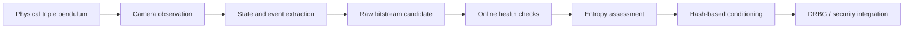

# Triple Pendulum / ENTRIP

This repository is the project hub for **ENTRIP**, a research project exploring a camera-observed triple pendulum as part of a physical-entropy architecture for hardware true random number generation (TRNG).

One technical idea was developed through several competitions and university programs. The `main` branch keeps the common project narrative, while each event branch preserves the scope, claims, and artifacts that were submitted at that stage.

> Research status: prototype architecture and initial validation. This project does **not** claim NIST SP 800-90B certification or production-ready cryptographic assurance.

## Branch map

| Branch | Event | Focus | Result / status |
| --- | --- | --- | --- |
| [`competition/ask-2026`](https://github.com/limshoon/triple-pendulum/tree/competition/ask-2026) | ASK 2026, Korea Information Processing Society | Initial system design, simulator, and validation direction | Undergraduate Paper Competition Bronze Award |
| [`competition/cisc-s-2026`](https://github.com/limshoon/triple-pendulum/tree/competition/cisc-s-2026) | CISC-S'26, Korea Institute of Information Security & Cryptology | Security boundary, raw/conditioned output separation, evaluation and attack framework | Poster paper #354 |
| [`competition/kiyo-2026`](https://github.com/limshoon/triple-pendulum/tree/competition/kiyo-2026) | KIYO 2026 | Invention and productization framing, module layout, interfaces, deployment scenarios | Product brief submission |
| [`campus/ajou-masterclass-2026`](https://github.com/limshoon/triple-pendulum/tree/campus/ajou-masterclass-2026) | Ajou Masterclass 2026 | Quantitative dynamics, camera-noise model, event extraction, conditioning, threat model | Final presentation |

## Core research question

Can the irregular, observable motion of a real triple pendulum contribute useful physical uncertainty to a security-oriented random-number-generation pipeline?

The project treats this as an entropy-source engineering problem rather than assuming that visual chaos automatically equals secure randomness.

## Common architecture

The architecture keeps the physical source, measurement channel, raw output, health testing, conditioning, and final generator separate so that each claim can be evaluated independently.

## How the project evolved

- **Initial design:** model the three-link dynamics, build a browser-based simulator, and define camera-based state reconstruction.
- **Security methodology:** distinguish raw entropy candidates from cryptographic output and define trust boundaries, attacks, source failures, and long-term validation needs.
- **Quantitative refinement:** measure initial-condition sensitivity, model 120 fps camera observation, separate sensor-noise-driven events from chaos-driven events, and introduce RCT/APT-style online checks with SHA-256 conditioning.
- **Product framing:** translate the research architecture into pendulum, observation, processing, enclosure, and external-interface modules.

## Verified outcomes

- The CISC-S'26 official program lists paper **#354**, `하드웨어 삼중진자 기반 TRNG의 설계 및 보안 검증 방법론`, by the Ajou University team in poster session P1.
- The ASK 2026 official program lists `하드웨어 삼중진자 기반 진난수 생성 시스템의 설계 및 초기 검증` as a **Bronze Award** undergraduate paper.

Official records:

- [CISC-S'26 program book](https://kiisc.or.kr/bbs/downloadBoardImage?uploadedFileId=14823)
- [ASK 2026 program](https://ask.kips.or.kr/programBook)
- [KIPS award record](https://kips.or.kr/societyAwards)

## Team

- Seung-Hoon Lim - first author and presenter
- Han-Sol Kim
- Jae-Young Jeong
- Hye-Ryeong Lee
- Prof. Jin Kwak - faculty advisor

Ajou University, Republic of Korea.

## Repository policy

- `main` is navigation and shared context only; competition-specific deliverables live on their corresponding branches.
- Branches preserve the claims and emphasis of that event rather than rewriting every submission into one final narrative.
- Drafts, duplicates, receipts, payment records, identity documents, signatures, birth dates, travel records, and recommendation forms are excluded.
- Unpublished KCI manuscript drafts are excluded until publication status and sharing rights are clear.
- Cloud-only media and models are excluded until their contents can be inspected locally.
- The source folder did not contain the simulator source code or experiment datasets, so this repository does not claim reproducibility from the currently available files.

## 한국어 안내

이 저장소는 삼중진자 기반 물리 엔트로피 연구 `ENTRIP`의 통합 허브입니다. `main`에는 전체 연구 흐름과 대회별 브랜치 지도를 두고, ASK·CISC-S·KIYO·아주마스터클래스에서 실제로 제출하거나 발표한 자료는 각 브랜치에 분리했습니다. 대회마다 연구 단계와 강조점이 달랐던 점을 그대로 남기기 위한 구조입니다.

## Rights and reuse

This repository is provided for portfolio viewing. Competition materials are coauthored works and may be subject to publisher or organizer rights. No permission to reproduce, modify, or redistribute them is granted without prior consent from the relevant rights holders.
