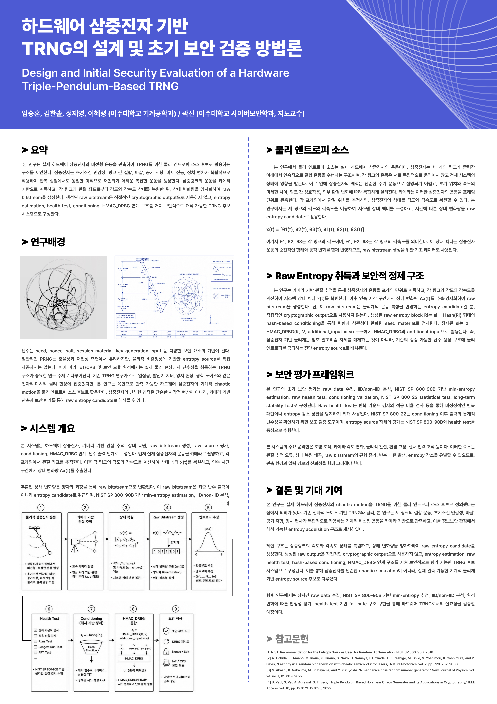
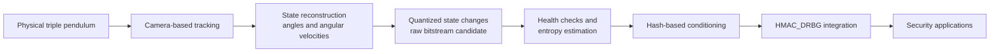

# ENTRIP: Triple-Pendulum Physical Entropy for TRNG

ENTRIP explores whether the irregular motion of a physical triple pendulum can serve as an entropy-source candidate for a hardware true random number generator (TRNG). A camera observes the pendulum, the system reconstructs its motion state, and changes in that state are converted into a raw bitstream for evaluation and conditioning.

> This repository is a curated research portfolio. It documents system design and initial validation; it does **not** claim NIST SP 800-90B certification or production-ready cryptographic assurance.

## Project at a glance

- **Domain:** hardware security, nonlinear dynamics, physical entropy, random number generation
- **Core idea:** use observable mechanical chaos and real-world perturbations as a candidate source of physical entropy
- **Acquisition:** camera-based tracking of a three-link pendulum
- **State model:** link angles and angular velocities, including frame-to-frame state changes
- **Output architecture:** raw bitstream -> health checks and entropy estimation -> hash-based conditioning -> HMAC_DRBG integration
- **Research stage:** system design, simulator-based exploration, hardware-oriented architecture, and initial local statistical prechecks

## System pipeline

The architecture deliberately separates the raw physical source from the conditioned output. Raw motion-derived data is treated as material to be measured and tested, not as a cryptographic output by itself.

## Research contributions

1. **Physical entropy-source framing**  
   Defines real triple-pendulum motion - including friction, manufacturing tolerance, vibration, lighting, and optical tracking error - as a measurable entropy-source candidate rather than relying only on a deterministic chaotic map.

2. **Camera-based acquisition design**  
   Proposes reconstructing link states from video, keeping sensors off the joints and making the physical source directly observable.

3. **Security-oriented output separation**  
   Separates raw acquisition, health testing, entropy estimation, conditioning, and DRBG integration so each layer can be evaluated independently.

4. **Evaluation and threat framework**  
   Identifies environmental manipulation, tracking error, mechanical wear, source bias, repeated patterns, and long-term stability as validation targets.

5. **Research-to-product translation**  
   Extends the academic architecture into an enclosure, interface, and deployment concept for server, embedded, and IoT security environments.

## Outcomes

- **CISC-S'26, Korea Institute of Information Security & Cryptology**  
  Poster paper #354, *Design and Security Evaluation Methodology of a Hardware Triple-Pendulum-Based TRNG*. The entry appears in the [official CISC-S'26 program book](https://kiisc.or.kr/bbs/downloadBoardImage?uploadedFileId=14823).

- **ASK 2026, Korea Information Processing Society**  
  The earlier paper, *Design and Initial Validation of a Hardware Triple-Pendulum True Random Number Generation System*, received a **Bronze Award** in the undergraduate paper competition. See the [official ASK 2026 program](https://ask.kips.or.kr/programBook) and [KIPS award record](https://kips.or.kr/societyAwards).

## Portfolio artifacts

| Artifact | Purpose |
| --- | --- |
| [CISC-S'26 paper](docs/cisc-s-2026-paper.pdf) | Security architecture, trust boundary, evaluation methodology, and research positioning |
| [CISC-S'26 poster](docs/cisc-s-2026-poster.pdf) | One-page visual explanation of the complete system |
| [KIYO 2026 product brief](docs/kiyo-2026-product-brief.pdf) | Product form, module layout, interfaces, and deployment scenarios |

## Team

- Seung-Hoon Lim - first author and presenter
- Han-Sol Kim
- Jae-Young Jeong
- Hye-Ryeong Lee
- Prof. Jin Kwak - faculty advisor

Ajou University, Republic of Korea.

## Scope and limitations

- The discovered project folder contained papers, posters, reports, media, and a 3D model, but no source-code or experiment-data files. This portfolio therefore focuses on verified research artifacts rather than claiming reproducibility that the available files cannot support.
- Initial statistical checks are design feedback, not a substitute for formal entropy assessment, long-duration source characterization, independent review, or certification.
- Hardware media and the STL model were not included because their cloud-only originals could not be inspected reliably during curation.
- Drafts, duplicates, receipts, payment records, identity documents, signatures, birth dates, travel records, and other administrative materials were intentionally excluded.

## 한국어 요약

ENTRIP은 실제 삼중진자의 비선형 운동을 카메라로 관측하고, 각 링크의 상태 변화에서 원시 비트열 후보를 생성한 뒤 health test, 엔트로피 추정, 해시 기반 정제, HMAC_DRBG 연계를 거치는 하드웨어 TRNG 연구입니다. 이 저장소는 CISC-S'26 최종 논문과 포스터, KIYO 제품 설명서를 중심으로 구성한 포트폴리오이며, 공식 인증 완료나 상용 암호 장치 수준의 안전성을 주장하지 않습니다.

## Rights and reuse

This repository is provided for portfolio viewing. The papers and poster are coauthored works; copyright and publication rights remain with their respective authors and publishers. No permission to reproduce, modify, or redistribute the included materials is granted without prior consent.

